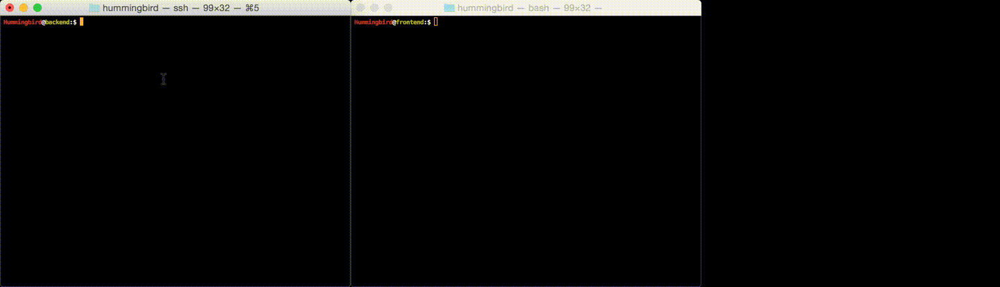

> Monitoring and analysing flash X-ray imaging experiments in real time.

	

		

	        </a>
		

	

### Download
Download the [latest release](https://github.com/FXIhub/hummingbird/releases) or clone the project from [Github](https://github.com/FXIhub/hummingbird).

### How to cite
Daurer, B. J., Hantke, M. F., Nettelblad, C. & Maia, F. R. N. C. (2016). J. Appl. Cryst. **49**, 1042-1047. [http://dx.doi.org/10.1107/S1600576716005926](http://dx.doi.org/10.1107/S1600576716005926).
