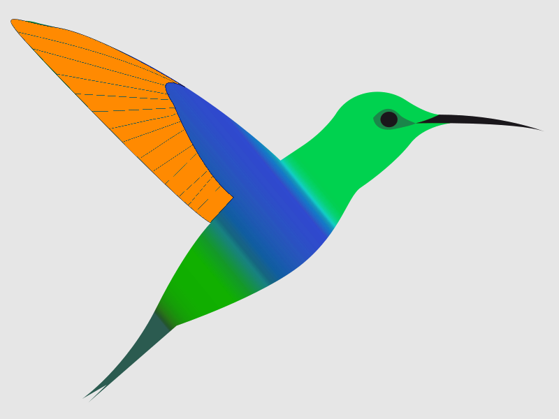



> **SPIhub** is a collaborative repository for Single Particle Imaging (SPI). The goal is to host and maintain a comprehensive and versatile collection of tools and other ressources to be used in the community of Single Particle Imaging with modern X-ray sources.

<!-- 
 -->
<!-- 	
 -->
<!-- 	
 -->
<!-- 		 -->
<!-- 		
 -->
<!-- 			<a href="hummingbird"><h2>Hummingbird</h2></a>		 -->
<!-- 			Text, Text, Text, Text. 		Text, Text, Text, Text 		Text, Text, Text, Text -->
<!-- 		
 -->
<!-- 	
 -->
<!-- 	
 -->
<!-- 	
 -->
<!-- 	
 -->
<!-- 		 -->
<!-- 		
 -->
<!-- 			<a href="hummingbird"><h2>Hummingbird</h2></a>		 -->
<!-- 			Text, Text, Text, Text. 		Text, Text, Text, Text 		Text, Text, Text, Text -->
<!-- 		
 -->
<!-- 	
 -->
<!-- 	
 -->
<!-- 
 -->

<!-- 
 -->
<!-- 	
		 -->
<!-- 		
 -->
<!-- 			
 -->
<!-- 				 -->
<!-- 		   	
 -->
<!-- 		
 -->
<!-- 		
 -->
<!-- 			<a href="hummingbird"><h2>Hummingbird</h2></a> -->
<!-- 			Text, Text, Text, Text. 		Text, Text, Text, Text 		Text, Text, Text, Text -->
<!-- 		
 -->
<!-- 	
 -->
<!-- 
 -->

<!-- 
 -->

	

		

	        
			

				<a href="hummingbird"><h3>Hummingbird</h3></a>
				
A framework for online analysis of Single Particle Imaging experiments using X-ray free-electron lasers. 

				
<a href="https://github.com/SPIhub/hummingbird" class="btn btn-danger" role="button">Code on Github</a> <a href="hummingbird/docs" class="btn btn-info" role="button">Documentation</a>

			

		

	

	

		

	        
			

				<h3>libspimage</h3>
				
...

				
<a href="https://github.com/FilipeMaia/libspimage" class="btn btn-danger" role="button">Code on Github</a> 

			

		

	

	

		

	        
			

				<h3>spitools</h3>
				
...

				
<a href="#" class="btn btn-danger" role="button">Code on Github</a> 

			

		

	

