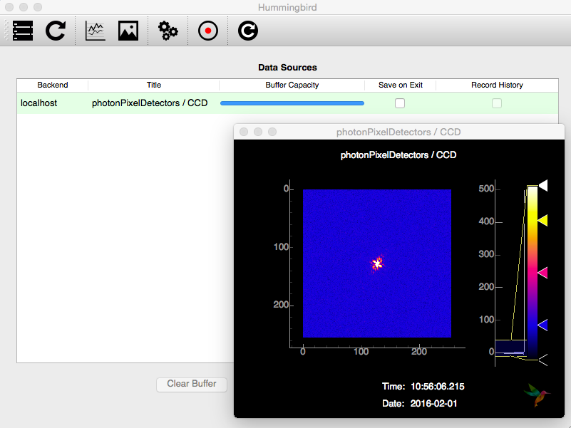



> **SPIhub** is a collaborative repository for Single Particle Imaging (SPI). The goal is to host and maintain a comprehensive and versatile collection of tools and other ressources to be used in the community of Single Particle Imaging with modern X-ray sources.

	

		

	        
			

				<a href="hummingbird"><h3>Hummingbird</h3></a>
				
A framework for online analysis of Single Particle Imaging experiments using X-ray free-electron lasers. 

				
<a href="https://github.com/SPIhub/hummingbird" class="btn btn-danger" role="button">Code on Github</a> <a href="hummingbird/docs" class="btn btn-info" role="button">Documentation</a>

			

		

	

	

		

	        
			

				<a href="owl"><h3>Owl</h3></a>
				
A visualization tool for the <a href="https://cxidb.org">CXI file format</a> with built-in data anlysis features for Single Particle Imaging diffraction data.

				
<a href="https://github.com/FilipeMaia/owl" class="btn btn-danger" role="button">Code on Github</a> 

			

		

	

	

		

	        
			

				<a href="hawk"><h3>Hawk</h3></a>
				
 collection of software tools which aim at reconstructing objects from oversampled diffraction data.

				
<a href="https://github.com/FilipeMaia/hawk" class="btn btn-danger" role="button">Code on Github</a> <a href="http://xray.bmc.uu.se/~filipe/?q=hawk/documentation" class="btn btn-info" role="button">Documentation</a>

			

		

	

